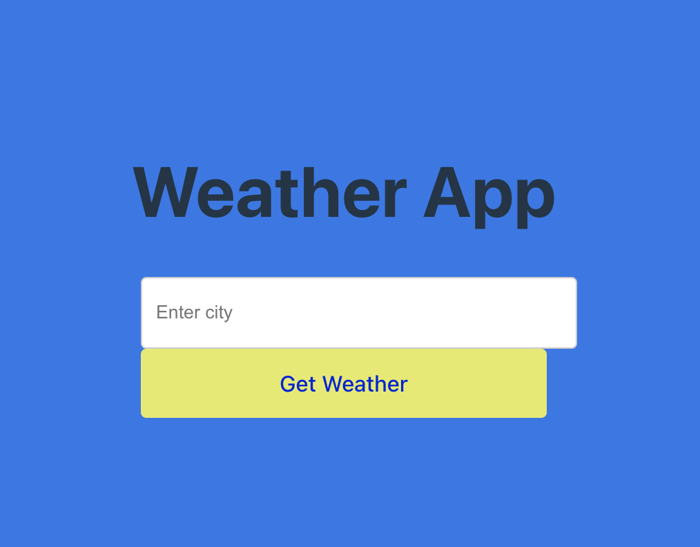

# Weather App

A modern weather application that allows users to search for real-time weather conditions by city name. The application fetches data from the OpenWeather API through a secure backend server.

## Features

- Search weather conditions by city name
- Display current temperature, humidity, wind speed, and weather conditions
- Responsive and user-friendly interface
- Error handling for invalid inputs
- Real-time weather data updates

## Tech Stack

### Frontend
- React.js
- Vite (Build tool)
- Modern UI/UX design

### Backend
- Node.js
- Express.js
- OpenWeather API integration

## Installation

### Prerequisites
- Node.js (v14 or higher)
- npm or yarn package manager
- OpenWeather API key

### Getting Started

1. Clone the repository
```bash
git clone https://github.com/aya-asylbek/weather-app.git
cd weather-app
```

2. Backend Setup
```bash
# Navigate to server directory
cd server

# Install dependencies
npm install

# Create .env file and add your OpenWeather API key
echo "OPENWEATHER_API_KEY=your_api_key_here" > .env

# Start the server
npm start
```

3. Frontend Setup
```bash
# Navigate to client directory
cd client

# Install dependencies
npm install

# Start the development server
npm run dev
```

## Usage

1. Access the application at `http://localhost:5173`
2. Enter a city name in the search bar
3. View detailed weather information including:
   - Temperature
   - Humidity
   - Wind speed
   - Weather conditions

## API Documentation

### Weather Endpoint

```
GET /weather?cityName={city}
```

**Parameters:**
- `cityName` (required): Name of the city to fetch weather data for

**Example Request:**
```
http://localhost:3001/weather?cityName=Sunnyvale
```

## Screenshots

### Home Page


### Weather Details - Madrid Example


### Weather Details - Barcelona Example


### Error Handling


## Contributing

Contributions are welcome! Please feel free to submit a Pull Request.

## Author

[aya-asylbek](https://github.com/aya-asylbek)

## License

This project is licensed under the MIT License - see the [LICENSE](LICENSE) file for details.

